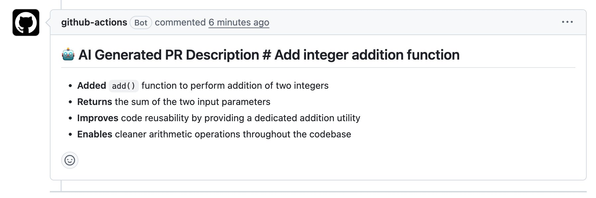

# LLM PR Description Generator

A GitHub Actions pipeline that automatically generates PR descriptions using the Anthropic Claude API. When a pull request is opened or updated, the workflow captures the git diff, sends it to Claude, and posts a structured description as a PR comment — no manual writing required.

## Demo



## How It Works

```
Pull Request Opened
       │
       ▼
GitHub Actions Triggers
       │
       ▼
Capture git diff (changed lines between branch and main)
       │
       ▼
Send diff to Claude API (Anthropic) with a prompt
       │
       ▼
Post generated description as a PR comment
```

## Tech Stack

- **Go** — script that calls the Anthropic API
- **Anthropic Claude API** — LLM that generates the PR description
- **GitHub Actions** — CI/CD pipeline that orchestrates everything
- **GitHub CLI (`gh`)** — posts the comment on the PR

## Setup

**1. Clone the repo**
```bash
git clone https://github.com/medhaships/llm-pr-description-generator.git
cd llm-pr-description-generator
```

**2. Add your Anthropic API key to GitHub Secrets**

Go to your repo → Settings → Secrets and variables → Actions → New repository secret

- Name: `ANTHROPIC_API_KEY`
- Value: your key from [console.anthropic.com](https://console.anthropic.com)

**3. That's it**

Open a pull request. The workflow triggers automatically and posts a description within seconds.

## What I Learned

- LLM API calls are just POST requests — the hard part is the prompt, not the integration
- Multi-line values in `$GITHUB_OUTPUT` need heredoc syntax or they get truncated
- Pass dynamic content via env vars, not inline YAML — special characters will break you
- gh CLI beats `actions/github-script` for simple use cases — less ceremony

## Future Improvements

- Truncate large diffs before sending to the API — very large PRs can hit token limits
- Add a check to skip the workflow if the diff is empty
- Experiment with prompt variations to improve output quality for different types of changes
